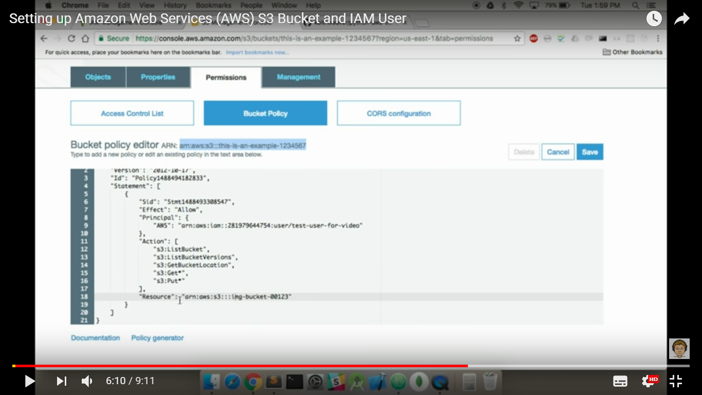

# AngularJS Client Side Image Compression and Upload to AWS S3
An example AngularJS app demonstrating client-side image compression and uploading to AWS S3.


An excellent video on obtaining your S3 keys can be <a href="https://www.youtube.com/watch?v=v33Kl-Kx30o">found here</a>

Keitch's video includes how to create an AWS IAM User, and how to set your permissions with your S3 Bucket Policy:



You should add .env file to your root directory that includes the credentials of your IAM User:

```bash
ACCESSKEYID=IAM-Access-Key-ID
SECRETACCESSKEY=IAM-Secret-Access-Key
BUCKET=Your-S3-Bucket-Name
```

Also, within your server.js set 's3.region' to one of these strings:

```bash
	us-east-1
	us-west-2
	us-west-1
	eu-west-1
	eu-central-1
	ap-southeast-1
	ap-southeast-2
	ap-northeast-1
	sa-east-1
```

## How to save your Bucket Policy on AWS S3: ##

If you want your images to be public by default:

<p>s3:GetObject applies to the objects in the bucket so the Resource should be: “Resource”: “arn:aws:s3:::posttestasset/*”.

s3:ListBucket applies to the Bucket itself and so the Resource should be “Resource”: “arn:aws:s3:::posttestasset”</p>

```bash
{
    "Version": "2012-10-17",
    "Statement": [
        {
            "Effect": "Allow",
            "Action": [
                "s3:ListBucket"
            ],
            "Principal": "*",
            "Resource": [
                "arn:aws:s3:::posttestasset"
            ]
        },
        {
            "Effect": "Allow",
            "Principal": "*",
            "Action": [
                "s3:PutObject",
                "s3:GetObject",
                "s3:DeleteObject"
            ],
            "Resource": [
                "arn:aws:s3:::posttestasset/*"
            ]
        }
    ]
}


```

## Demonstrates: ##
* AWS S3 Integration
* HTML5 Canvas
* HTML5 FileReader API
* AngularJS
* Angular Bootstrap (Tabs)
* Array Manipulation
* Bootstrap CSS
* Basic Responsive Design
* Basic Form Validation

## Credits: ##
* [resample_hermite](https://github.com/viliusle/Hermite-resize/)
* [dataURItoBlob](http://stackoverflow.com/a/5100158/)
* [Angular File Upload by nervgh](https://github.com/nervgh/angular-file-upload/)


